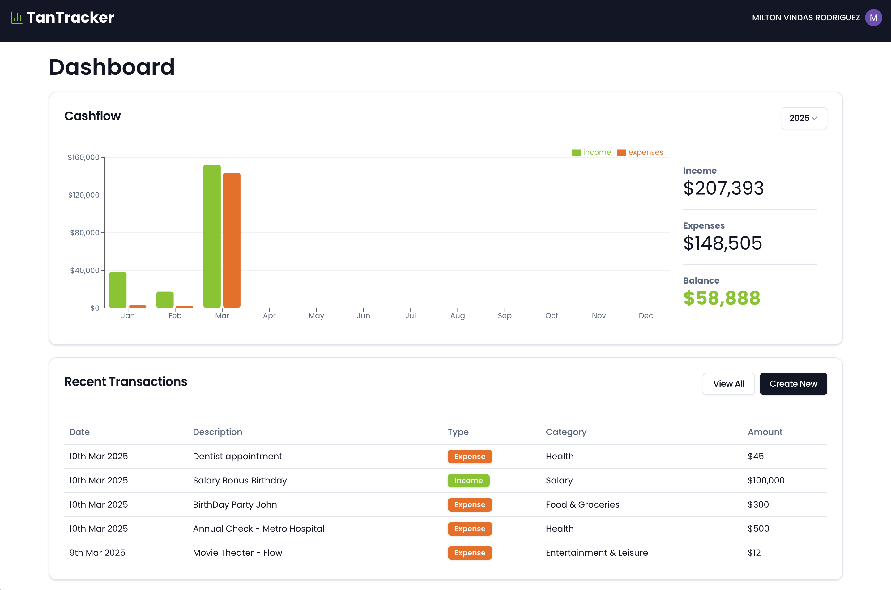

# TanTracker

[](https://tanstack.com/)
[](https://www.typescriptlang.org)
[](https://tailwindcss.com/docs/installation)
[](https://ui.shadcn.com/)
[](https://www.npmjs.com/)
[](https://www.postgresql.org/)
[](https://orm.drizzle.team/)
[](https://zod.dev/)
[](https://clerk.dev/)

---

**TanTracker** is a powerful and user-friendly income and expense tracking application designed to help users manage their finances efficiently. With TanTracker, users can log their income and expenses, view detailed reports, and manage their accounts with ease. The application leverages modern web development technologies to provide a seamless and responsive user experience.



---

## Installation

To get started with this project, follow these steps:

1. Clone this repository to your local machine:

```bash
git clone https://github.com/mvindasr/tantracker.git
```

2. Navigate to the project directory

```bash
cd tantracker
```

3. Install all dependencies

```bash
pnpm install
```

4. Setup .env file

Create a `.env` file in the `root` of the project. You can do it by copying the `.env.example` file:

```bash
cp ./.env.example ./.env
```

> The command assumes an unix environment where the `cp` command is available.

Once you have the `.env` file, add the environment variable values in the file.

```env
CLERK_PUBLISHABLE_KEY=your-clerk-publishable-key
CLERK_SECRET_KEY=your-clerk-secret-key
DATABASE_URL=your-database-url
```

## Usage

Once you have set up the project and installed the dependencies, you can run the application locally:

```bash
npm run dev
```

This command will start the development server, and you can access the application at http://localhost:3000/.
